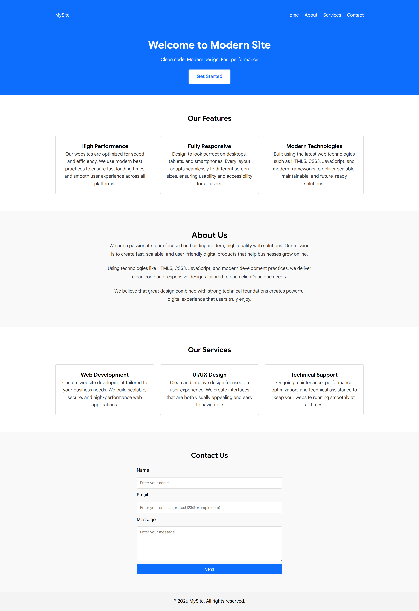
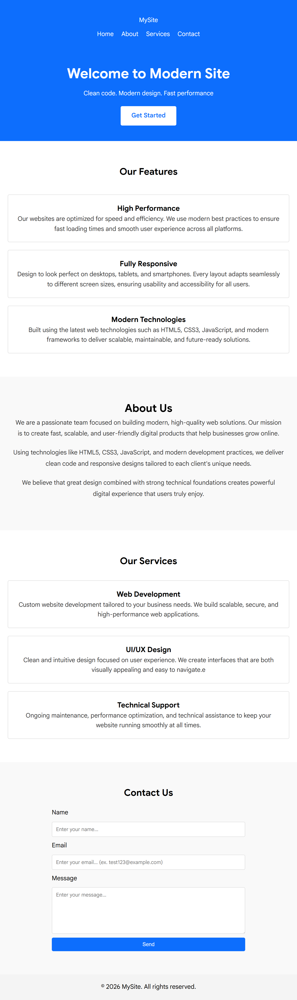
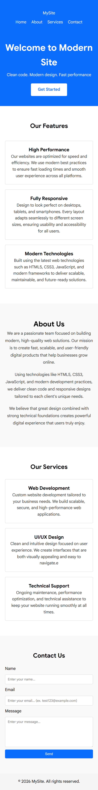

# Responsive Landing Page

> A modern and fully responsive landing page built with semantic HTML5 and CSS3, focused on accessibility, performance, clean structure, and responsive design.

## 🔗 Live Demo

[View Live Demo](https://responsive-landing-page-mshchebetiuk.netlify.app/)

## 📸 Preview



### 📱 Tablet



### 📱 Mobile



## ✨ Features

- Fully responsive layout for mobile, tablet, and desktop
- Semantic HTML5 structure
- Modern CSS layouts with Flexbox and Grid
- BEM methodology
- Clean and maintainable CSS structure
- Accessible user interface
- Optimized performance
- Cross-device responsive design

## 🛠️ Tech Stack

- HTML5
- CSS3
- Flexbox
- CSS Grid
- BEM
- Git
- GitHub
- Vercel

## 📁 Project Structure

```text
responsive-landing-page/
├── css/
├── images/
├── screenshots/
├── index.html
└── README.md
```

## ⚡ Lighthouse Performance

The project achieved perfect Lighthouse scores:

- Performance — 100
- Accessibility — 100
- Best Practices — 100
- SEO — 100

## 🚀 Getting Started

### Clone the repository

```bash
git clone https://github.com/mshchebetiuk/responsive-landing-page.git
```

### Navigate to the project

```bash
cd responsive-landing-page
```

### Run the project

No dependencies or build tools are required.

Open `index.html` directly in your browser.

## 🎯 What I Practiced

During this project, I practiced:

- Building responsive layouts from scratch
- Writing semantic HTML
- Working with Flexbox and CSS Grid
- Applying the BEM methodology
- Creating layouts for different screen sizes
- Improving accessibility
- Optimizing Lighthouse performance
- Organizing CSS and project assets

## 🔮 Future Improvements

- Add additional interactive elements
- Improve animations and transitions
- Expand accessibility testing
- Add more reusable UI sections

## 👨‍💻 Author

**Maksym Shchebetiuk**

- GitHub: https://github.com/mshchebetiuk
- LinkedIn: https://www.linkedin.com/in/maksym-shchebetiuk-bb53102a0/

## 📄 License

This project is created for educational and portfolio purposes.
